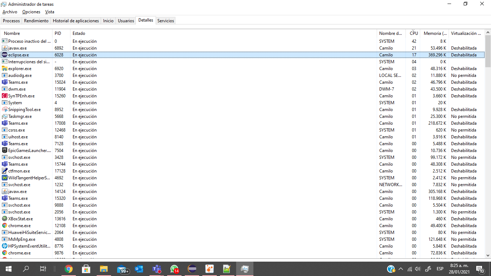
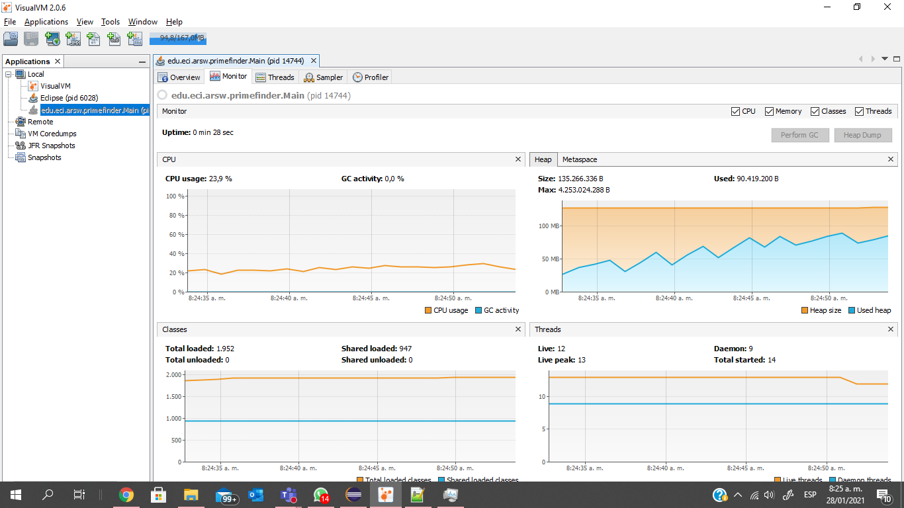

### Escuela Colombiana de Ingeniería

### Arquitecturas de Software – ARSW
## Laboratorio Programación concurrente, condiciones de carrera, esquemas de sincronización, colecciones sincronizadas y concurrentes - Caso Dogs Race

## Integrantes 
* Carlos Andres Amorocho Amorocho
* Rubian Camilo Saenz Rodriguez

### Descripción:
Este ejercicio tiene como fin que el estudiante conozca y aplique conceptos propios de la programación concurrente.

### Parte I 
Antes de terminar la clase.

Creación, puesta en marcha y coordinación de hilos.

1. Revise el programa “primos concurrentes” (en la carpeta parte1), dispuesto en el paquete edu.eci.arsw.primefinder. Este es un programa que calcula los números primos entre dos intervalos, distribuyendo la búsqueda de los mismos entre hilos independientes. Por ahora, tiene un único hilo de ejecución que busca los primos entre 0 y 30.000.000. Ejecútelo, abra el administrador de procesos del sistema operativo, y verifique cuantos núcleos son usados por el mismo.

Al ejecutar el programa se puede evidenciar lo siguiente:

Primero se evidencia que en los procesos del administrador de tareas se encuentra en ejecución y es de los programas que mas utiliza recursos de la CPU.

En esta imagen se ve que durante la ejecucion del programa el consumo es muy alto con respecto a las demas funcionalidades del sistema.

El número de nucleos que utiliza es de 4 y se evidencia como son utilizados estos durante la ejecución del programa con 1 solo Thred y según este utiliza un 18% de la CPU.

En VisualVM la ejecucion del programa demoro 48 segundos y segun este utilizo un 12,1% del total de la CPU

2. Modifique el programa para que, en lugar de resolver el problema con un solo hilo, lo haga con tres, donde cada uno de éstos hará la tarcera parte del problema original. Verifique nuevamente el funcionamiento, y nuevamente revise el uso de los núcleos del equipo.

Al modificar el programa para que este corra con 3 Threads y cada uno tenga la tercera parte del total del intervalo descrito, es decir cada Thread tendra alrededor de 10000000 de numeros que analizar.

Al ejecutar el programa con 3 Threads se puede ver el cambio con respecto a los recursos de la CPU.

El proceso se evidencia cambia y de igual manera es de las aplicaciones con mayor consumo respecto a otras.

El porcentaje de la CPU cambia a 46% y los 4 nucleos trabajan casi con el mismo nivel.

Segun VisualVM ahora utiliza el 23% de la CPU y se reduce el tiempo de trabajo a 28 segundos.

3. Lo que se le ha pedido es: debe modificar la aplicación de manera que cuando hayan transcurrido 5 segundos desde que se inició la ejecución, se detengan todos los hilos y se muestre el número de primos encontrados hasta el momento. Luego, se debe esperar a que el usuario presione ENTER para reanudar la ejecución de los mismo.

### Parte II 

Para este ejercicio se va a trabajar con un simulador de carreras de galgos (carpeta parte2), cuya representación gráfica corresponde a la siguiente figura:

En la simulación, todos los galgos tienen la misma velocidad (a nivel de programación), por lo que el galgo ganador será aquel que (por cuestiones del azar) haya sido más beneficiado por el *scheduling* del
procesador (es decir, al que más ciclos de CPU se le haya otorgado durante la carrera). El modelo de la aplicación es el siguiente:

Como se observa, los galgos son objetos ‘hilo’ (Thread), y el avance de los mismos es visualizado en la clase Canodromo, que es básicamente un formulario Swing. Todos los galgos (por defecto son 17 galgos corriendo en una pista de 100 metros) comparten el acceso a un objeto de tipo
RegistroLLegada. Cuando un galgo llega a la meta, accede al contador ubicado en dicho objeto (cuyo valor inicial es 1), y toma dicho valor como su posición de llegada, y luego lo incrementa en 1. El galgo que
logre tomar el ‘1’ será el ganador.

Al iniciar la aplicación, hay un primer error evidente: los resultados (total recorrido y número del galgo ganador) son mostrados antes de que finalice la carrera como tal. Sin embargo, es posible que una vez corregido esto, haya más inconsistencias causadas por la presencia de condiciones de carrera.

Parte III

1.  

2.  
    ~~~
    Acá podemos evidenciar que todos los perros (hilos)
    entran y no hay control sobre lo que realizan en el método,
    por lo tanto se da la incosistencia entre los puestos.
    ~~~
    

3.  
    ~~~
    Realizamos una sincronización con Mutex, para 
    poder tener un control que sea solo un perro 
    el que entra para marcar su posición
    ~~~
    
  
    
    ~~~
    Resideñamos el método de correr para implementar mutex
    ~~~
      
      
      
    ~~~
    Iniciamos el Mutex en el main
    ~~~
     
      
      
4.  Implemente las funcionalidades de pausa y continuar. Con estas,
    cuando se haga clic en ‘Stop’, todos los hilos de los galgos
    deberían dormirse, y cuando se haga clic en ‘Continue’ los mismos
    deberían despertarse y continuar con la carrera. Diseñe una solución que permita hacer esto utilizando los mecanismos de sincronización con las primitivas de los Locks provistos por el lenguaje (wait y notifyAll).

